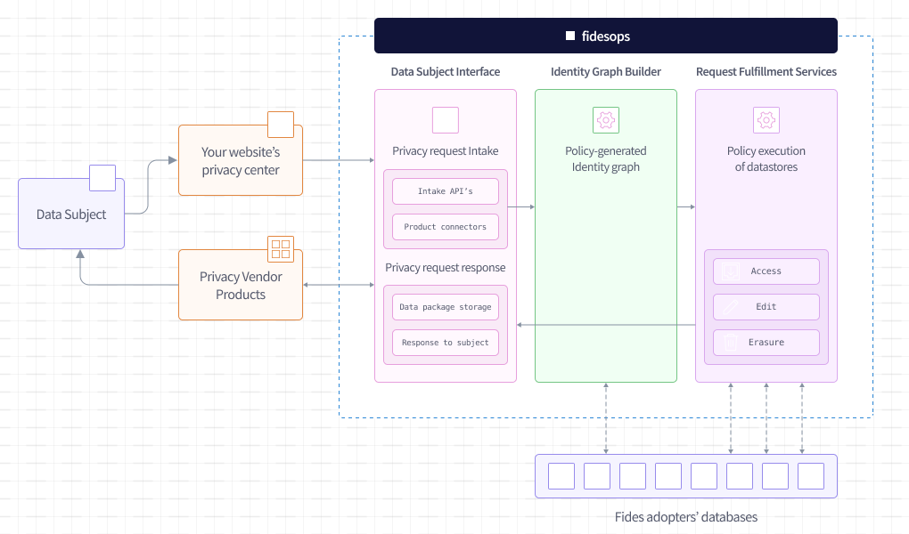

# Meet Fidesops: a privacy rights automation engine

_A part of the [greater Fides ecosystem](https://github.com/ethyca/fides)._

[![Latest Version][pypi-image]][pypi-url]
[![License][license-image]][license-url]
[![Code style: black][black-image]][black-url]
[![Checked with mypy][mypy-image]][mypy-url]
[![Twitter][twitter-image]][twitter-url]

## :zap: Overview

**Fidesops** (*fee-dez-äps*, combination of the Latin term "Fidēs" + "operations") is an open-source, extensible, deployed engine that fulfills any privacy request (e.g. access request, erasure request) by connecting directly to your disparate databases.

## :rocket: Quick Start

Get started with [our tutorial](docs/fidesops/docs/tutorial/index.md), which can be quickly deployed using Docker. 

### Documentation

For more information on getting started with Fidesops, how to configure and set up Fidesops, and more about the Fides ecosystem of open source projects: 

- Documentation: https://ethyca.github.io/fidesops/
- How-to guides: https://ethyca.github.io/fidesops/guides/oauth/
- Deployment: https://ethyca.github.io/fidesops/deployment/
- Roadmap: https://github.com/ethyca/fidesops/milestones
- Website: www.ethyca.com/fides

### Support

Join the conversation on:

- [Slack](https://join.slack.com/t/fidescommunity/shared_invite/zt-vlgpv1r9-gcYrLpQyNoRf9dJu~kqE8w)
- [Twitter](https://twitter.com/ethyca)
- [Discussions](https://github.com/ethyca/fidesops/discussions)

### Contributing

We welcome and encourage all types of contributions and improvements!  Please see our [contribution guide](CONTRIBUTING.md) to opening issues for bugs, new features, and security or experience enhancements.

Read about the [Fides community](https://ethyca.github.io/fidesops/community/github/) or dive into the [development guides](https://ethyca.github.io/fidesops/development/overview) for information about contributions, documentation, code style, testing and more. Ethyca is committed to fostering a safe and collaborative environment, such that all interactions are governed by the [Fides Code of Conduct](https://ethyca.github.io/fidesops/community/code_of_conduct/).

## :balance_scale: License

The Fides ecosystem of tools ([Fidesops](https://github.com/ethyca/fidesops) and [Fidesctl](https://github.com/ethyca/fides)) are licensed under the [Apache Software License Version 2.0](https://www.apache.org/licenses/LICENSE-2.0).
Fides tools are built on [Fideslang](https://github.com/ethyca/privacy-taxonomy), the Fides language specification, which is licensed under [CC by 4](https://github.com/ethyca/privacy-taxonomy/blob/main/LICENSE). 

[pypi-image]: https://img.shields.io/pypi/v/fidesctl.svg
[pypi-url]: https://pypi.python.org/pypi/fidesctl/
[license-image]: https://img.shields.io/:license-Apache%202-blue.svg
[license-url]: https://www.apache.org/licenses/LICENSE-2.0.txt
[black-image]: https://img.shields.io/badge/code%20style-black-000000.svg
[black-url]: https://github.com/psf/black/
[mypy-image]: http://www.mypy-lang.org/static/mypy_badge.svg
[mypy-url]: http://mypy-lang.org/
[twitter-image]: https://img.shields.io/twitter/follow/ethyca?style=social
[twitter-url]: https://twitter.com/ethyca
