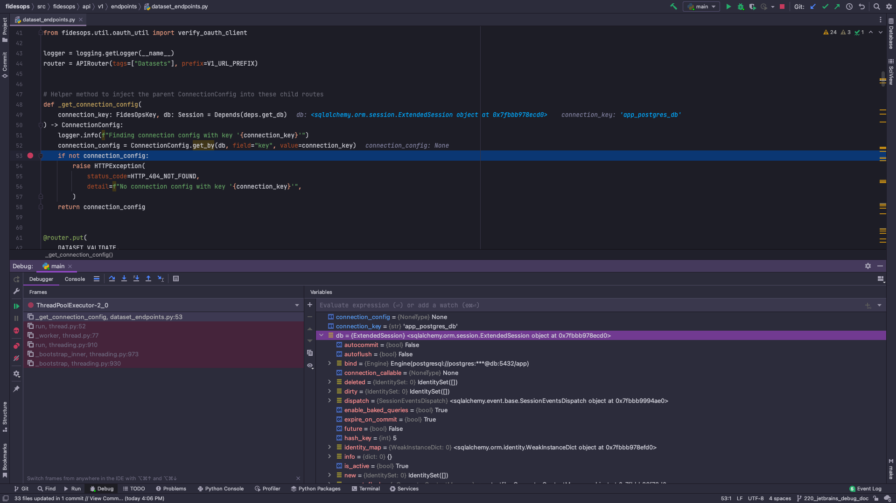

# Debugging Fidesops in IntelliJ IDEA Ultimate
This guide will show how to use the IntelliJ debugger with Fidesops running in Docker. 
The setup for PyCharm Professional should be very similar.

## Prerequisites
- Intellij IDEA Ultimate or PyCharm Professional
- Docker plugin
- Docker Desktop
- Fidesops

## Setup
### Connect to Docker daemon
**Settings/Preferences** -> **Docker** -> **+**

### Configure Python Remote Interpreter
**File** -> **Project Structure...** -> **Platform Settings** -> **SDKs** -> **+**

### Run/Debug Configuration
- To debug Fidesops, debug the `main.py` script
- Make sure to specify the remote interpreter created in the previous step
- Add `FIDESOPS_CONFIG_PATH=/fidesops` to Environment variables

## Hit a Breakpoint
Try firing a request to Fidesops from Postman and hit a break point

## Links
The information is this guide is largely based on these docs
- https://www.jetbrains.com/help/pycharm/using-docker-as-a-remote-interpreter.html
- https://www.jetbrains.com/help/idea/configuring-local-python-interpreters.html