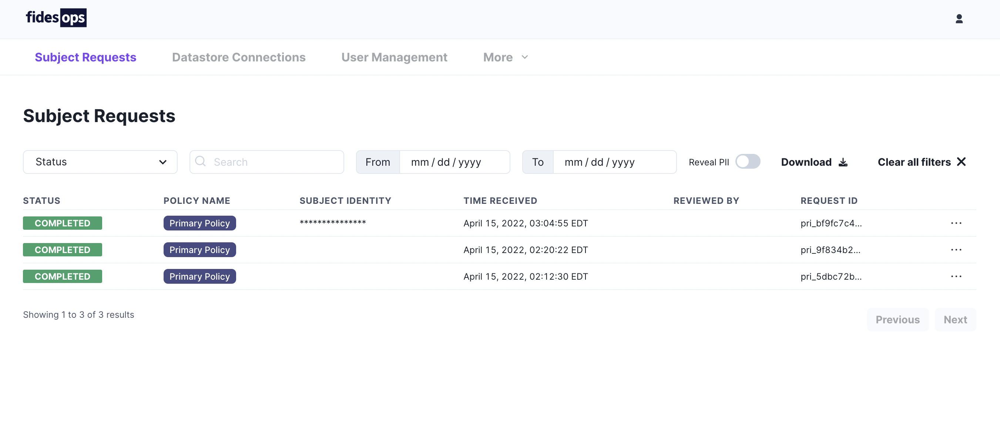

# Administrator UI

FidesOps provides a built-in control panel for managing privacy requests.



## Running Locally

To get started, clone the [FidesOps repository](https://github.com/ethyca/fidesops/).

### Creating the root user

In the top-level `fidesops` directory, run `make user`.

A series of prompts will walk you through creating a username and password. Passwords require 8 or more characters, upper and lowercase characters, a number, and a symbol. 

This will create an Admin UI Root User that can be used to access the in-browser control panel, and additional [user endpoints](#managing-users).

### Access the Control Panel

From the root `fidesops` directory, run the following:
``` sh
    cd clients/admin-ui
    npm install
    npm run dev
```

This will navigate you to the `admin-ui` directory, install the necessary packages, and run the development environment.

Navigate to `http://localhost:3000/`, and provide the Root User credentials you created in the previous step. For this user, the `email` field is simply the `user` that was created, and not a valid email address.

!!! tip "Only one root user can be created. Subsequent users should be managed via the available [Users endpoints](#creating-a-user)."

## Managing Users 

The Admin UI also provides several user-related endpoints for managing access to the control panel. Example requests are included in the FidesOps [Postman Collection](./../postman/using_postman.md).


### User and Endpoint Scopes
User permissions are managed through access tokens, which contain scopes associated to individual endpoints. Endpoint access can be restricted by removing their scope from an access token.

Creating a user currently provides access to all scopes.

### Logging in

```
POST api/v1/login
``` 

```json title="Request Body"
{
  "username": "test_username",
  "password": "Suitablylongwithnumber8andsymbol$"
}
```

Successful POST requests to the `login` endpoint will return an `access_token` with all available scopes. This token can be used to make subsequent requests to the Users endpoints.

### Logging out 

```
POST api/v1/logout
``` 

| Authentication | Scope | Description |
|---|---|---|
| Bearer token | N/A | An `access_token` returned from `login`. |

The `logout` endpoint will invalidate the provided `access_token`, which must be included as the Bearer token in your request.

### Creating a user

```
POST api/v1/user
``` 

```json title="Request Body"
{
  "username": "new_username",
  "password": "new_Suitablylongwithnumber8andsymbol$"
}
```

| Authentication | Scope | Description |
|---|---|---|
| Bearer token | `user:create` | An `access_token` returned from `login`. |

The `user` endpoint will create an additional user with the `username` and `password` provided in the request body. An `access_token` with a scope of `user:create` is required.


### Deleting a user

```
DELETE api/v1/user/<user_id>
``` 

| Authentication | Scope | Description |
|---|---|---|
| Bearer token | `user:delete` | An `access_token` returned from `login`. |

An `access_token` with a scope of `user:delete` is required, and must be associated to the Admin UI Root User, or the user you are trying to delete.