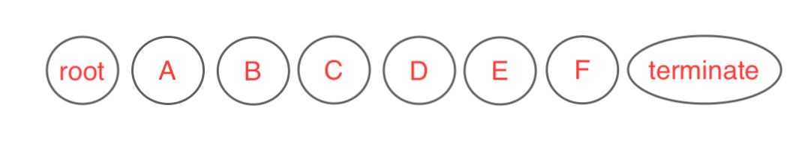

# Fidesops Privacy Request Execution

When a [Privacy Request](privacy_requests.md) is submitted, fidesops first performs some prerequisite checks, and
then visits your Collections in a largely automated way in two passes: first retrieving relevant data
for the subject across all your Collections and then optionally masking data for the subject. 

## Privacy Request Submission

When a user submits a request to fidesops to access or erase their data, fidesops first creates records
to store the relevant information, verifies the user's identity, and notifies relevant parties.

If applicable, these steps must be completed before the privacy request is queued for execution:

- Persist Step
  - Fidesops creates a PrivacyRequest in long-term storage to capture high-level information such as the date created and its current status.
  - Fidesops saves the identity of the subject to both short- and long-term storage.
- Verify Step
  - If configured, Fidesops sends an email to the user to verify their identity before proceeding.
- Notify Step
  - If configured, the user will receive an email verifying we've received their request.
- Approve Step
  - If configured, Fidesops may require a system administrator to approve the request before proceeding.

## Privacy Request Execution

Once the prerequisite steps above have been completed, the privacy request is moved to `in_processing` status 
and is dispatched to a separate queue for processing. Request execution involves gathering data from multiple
sources and/or masking data in multiple locations by following the steps below, skipping steps 
if they are not applicable for the given request:

   1. Manual Webhooks Step
   2. Policy Pre-Execution Webhooks Step
   3. Access Request Step
   4. Upload Access Results Step
   5. Erasure Request Step
   6. Email Erasure Requests Step
   7. Policy Post-Execution Webhooks Step
   8. Follow-up Email Notification Step

###1)  Manual Webhooks Step

Manual webhooks allow a fidesops admin to manually upload data pertaining to a subject.  If manual webhooks are 
configured and we don't have a data submissions for all webhooks, request execution will exit with a status of `requires_input`.

Fidesops admins should separately upload data for each webhook, or a blank response if no data is found.  The privacy
request can then be resumed, and request execution will continue from this step.  See [Manual Webhooks](manual_webhooks.md) for more information
on configuring manual webhooks and resuming a `requires_input` request.

Data uploaded for manual webhooks will be returned to the data subject directly at the end of request execution.  Data 
gathered here is not used to locate data from other sources.

### 2) Policy Pre-Execution Webhooks Step

Policy Pre-Execution Webhooks let your system take care of prerequisite tasks or locate additional subject identities
for the data subject. Examples might be turning on a specific database in your infrastructure or locating a phone number for a subject
from a table for which you do not want to give Fidesops direct access. Configuration will involve defining endpoint(s) for fidesops to call in order.  
See [Policy Webhooks](policy_webhooks.md) for more details.

Fidesops will send a request to each previously configured webhook with a specific request body defined in [Policy
Webhooks Request Format](policy_webhooks.md#Policy-Webhook-request-format) which your endpoints should be prepared to unpack.
If you need more time to carry out an action on your end, your webhook can instruct Fidesops to `halt`, which will cause 
execution to exit with a status of `paused`. Request execution can be continued when ready using a token that was 
supplied in the original request.

No data uploaded by Policy Webhooks is returned to the data subject, but identities discovered can be used 
to later locate data pertaining to the subject in the Access Request Step.

If a request to a pre-execution webhook fails, request execution will exit with a status of `error`. Retrying 
the privacy request will resume from this step and attempt to re-run all the pre-execution webhooks.

### 3) Access Request Step

The automated Access Request Step is performed regardless of whether there are Access or Erasure Rules defined, since
both Rules require this data.  See here to [Configure Policies, Rules, and Rule Targets](policies.md). This step visits all Collections and retrieves
all Fields that you've defined in your [Datasets](datasets.md). We build a graph in accordance with how you've designated your Collections are related, 
visit each Collection in turn, and end by gathering all the results together.

#### Graph building
Fidesops builds a DAG (Directed Acyclic Graph) from all Collections within your enabled Datasets. In other words, each location or node on the graph 
corresponds to a Collection in one of your Datasets. The graph helps determine the order in which nodes will be visited.
We start with any Collections that we can query just using the identity data, and then point those Collections toward
dependent Collections that need data from the current Collection and so on. If fidesops can't figure out how to 
reach a Collection, it will exit early with a status of `error`.  To remedy, you will have to
how your Collections are related to each other in your Datasets and resubmit the privacy request.

#### Graph Execution
After the graph is built, we pass this to Dask to execute (sequentially). We visit one Collection at a time, following 
the graph specified above, and use Dask to determine ordering for tiebreakers.  For the first Collections in the graph connected to the root, 
we use just the customers' identity to locate subject data, by 1) making database queries or 2) making HTTP requests to a 
configured API endpoint.  The details on how to access your data are determined by the [ConnectionConfig](connection_types.md) type.  We retrieve all Fields that have been configured on the Collection. We cache the results in 
temporary storage in multiple formats for usage later.  We then pass the results of that Collection to downstream 
Collections that similarly make queries, temporarily cache the results, and return their results to their own downstream Collections. 
A Collection isn't visited until we have searched for data across all of its upstream Collections. We continue until all Collections have been visited. See [Query Execution](query_execution.md) for more information.

If there is a failure trying to retrieve data on any Collections, the request is retried the configured number of times
until the request exits with status `error`.  Both the step (`access`) and errored Collection are cached in temporary storage. 
Restarting the privacy request will restart from this step and failed Collection.  Collections that have already been visited will not be visited again.

### Final result retrieval
The final step of the Access Request Step is gathering all the results for each Collection from temporary storage.

### 4) Upload Access Results Step

If configured, Fidesops then takes the results retrieved from the Access Request Step and uploads the data for the data subject. 

For each configured Access Rule, we filter the graph results to match targeted Data Categories. See [Datasets](datasets.md) for more details.
We also supplement the results with any data manually uploaded earlier in the Manual Webhooks step. Each data package is uploaded in JSON
or CSV format to a specified storage location like Amazon S3. See [Storage](storage.md) for more information.

### 5) Erasure Request Step

If applicable, meaning there are Erasure [Rules](policies.md#Rule-attributes) configured on this Policy, we build a simpler graph
than the graph used for Access requests, and visit each Collection in turn, performing masking requests as necessary. 

#### Graph building 
The "graph" for an Erasure is hardly a graph. We already have the data from the Access Request step in temporary storage which can 
be used to locate data for each Collection individually. Each Collection could technically be visited in any order or
run in parallel.  The graph is configured so each Collection has its previous Access Request results passed in as inputs,
and each Collection returns a count of records masked, when complete.

#### Graph execution
We visit each Collection sequentially using a deterministic order set by Dask. For each row of data retrieved
in the Access Request step, we attempt to mask the data targeting the fields you've specified on the Policy, 
also using the [Masking Strategies](masking_strategies.md) you've defined. If no rows exist from the Access Request Step 
or no Fields on that Collection match the targeted Data Categories, no masking occurs. We cache a count of the records 
that had fields masked in temporary storage.  The request to mask might involve an `update` database query or an `update` or `delete`
HTTP request depending on the [ConnectionConfig Type](connection_types.md).

The Email Connector type doesn't mask any data itself, but instead persists how to locate and mask that Collection in temporary storage
for use later.

If masking fails on a given Collection, Fidesops retries the requests for a configured number of times, and then request execution will
exit with a status of `error`.  Fidesops will cache both the failed Collection and the fact that we failed on the `erasure` step.
Retrying the privacy request will resume from the `Erasure` step at the failed Collection. Previously masked Collections will
not be masked again.

### 6) Make Erasure Requests via Email Step

After both Access and Erasure steps have executed, we check if we have any third parties that need to be additionally emailed 
to complete Erasure requests on your behalf. See [Email third party services to mask data](email_communications.md#Email-third-party-services-to-mask-data)
for more information.

We retrieve any masking instructions cached by EmailConnectors in the Erasure Request step and combine into a single 
email per Dataset.  

This step is only performed if you have EmailConnectors configured. If the email send fails for some reason, the request
will exit with status `error`.  We will cache this step in temporary storage, so retrying the request will resume from this point. 

### 7) Policy Post-Execution Webhooks Step

After automated Access and Erasures steps have completed, Policy Post Execution Webhooks can be used to perform any 
cleanup steps in your system.  Examples might be setting up a webhook on your end to shut down a database or delete user data 
from a source you don't want Fidesops to access directly.  Post-Execution webhooks are more limited than Pre-Execution 
Webhooks.  They currently cannot pause the graph. These should just be configured as a series of API endpoints
you'd like Fidesops to call.  See [Policy Webhooks](policy_webhooks.md) for more details on configuration.

If a request to a post-execution webhook fails, request execution will exit with a status of `error`. Retrying 
the privacy request will resume from this step and attempt to re-run all the Post-Execution webhooks.

### 8) Followup Email Notification Step

If configured, we will send a followup email to the data subject to let them know their request
has finished processing.  For Access Rules, the emails will contain links to where the data subject 
can retrieve data. For Erasure Rules, the emails will simplify notify that their Privacy Request is complete. 

Request execution should then exit with status `complete`.

## Worth Noting

- We use Redis as temporary storage to support executing your request.  We temporarily store things like the data
automatically retrieved from each Collection, manually uploaded data, and details about where the Privacy Request may
be paused or where it failed.  This information will expire in accordance with the `FIDESOPS__REDIS__DEFAULT_TTL_SECONDS` setting.
- Fidesops current execution strategy prioritizes being able to erase as many of the original Collections requested as possible.  If we mask 
some Collections and then we have a failure, current logic lets us mask the original remaining Collections 
using the temporarily saved data we retrieved in the original Access Step, instead of re-querying the Collections to figure 
out which data we should mask. Once data is masked in one Collection, it could potentially prevent us from being able to 
locate data in downstream Collections, so we opt to use our temporarily stored data.
    - The side effect is that data added in the interim or data related to newly added Collections can be missed.
    - If the Access Step fails part of the way through, a new Collection is added, and then the request is restarted from failure, 
      we are potentially missing data from already completed Collections downstream, plus any Collections further downstream of that set.
    - If the Erasure Step fails, a new Collection is added, and the request is restarted from failure, we potentially miss masking data from the new 
      Collection and data downstream of the new Collection.
- Nodes on the graph correspond to individual Collections within Datasets, not Datasets.  The graph built may result in Fidesops
visiting a Collection in one Dataset to be able to find data on a Collection in a separate Dataset, which is used to find 
data on a Collection in the original Dataset.
- The Access Request Step often selects more Fields than may be returned specifically to the user because this data has multiple uses. 
We select all Fields defined to be able to potentially query downstream Collections, filter data according to multiple Access Rules,
and mask data in accordance with multiple Erasure Rules.
