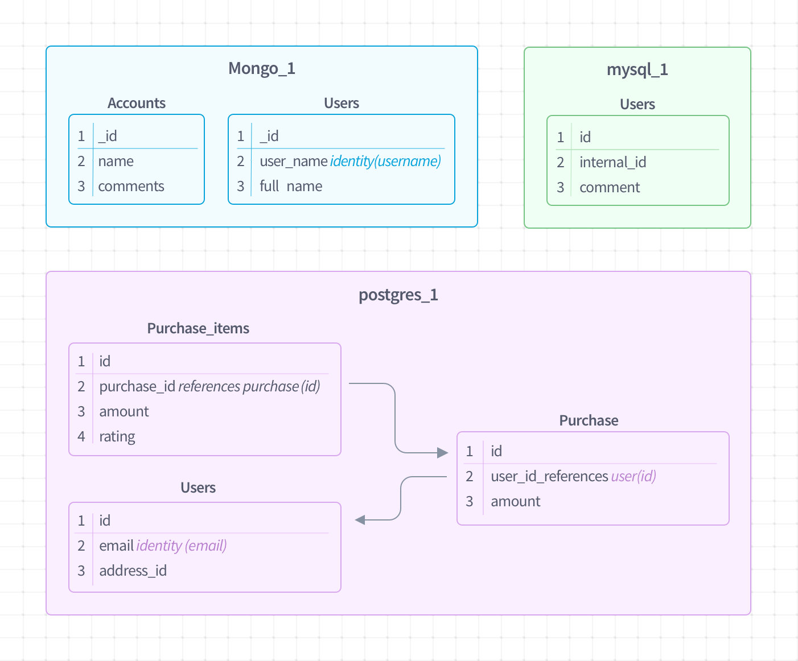

# Query Execution

## How does Fidesops generate traversals?

Let's look at a slightly larger example. In this example there are 3 separate databases, a mysql database that stores users and their comments, a postgres DB that stores purchase information, and a mongoDB that stores user accounts. Each of them may have related data that we'd like to retrieve.



The (abbreviated) specification of these datasets looks like:

```
dataset:
  - fides_key: mongo_1
    collections:
      - name: users
        fields:
	      - name: _id
            fidesops_meta:
              primary_key: True
          - name: user_name
            fidesops_meta:
              identity: username
		  - name: full_name

      - name: accounts
        fields:
          - name: _id
            fidesops_meta:
              primary_key: True
          - name: name
			fidesops_meta:
				references:
					- dataset: mongo_1
					  name: users.full_name
					  direction: from
          - name: comments
```

```
dataset:
  - fides_key: mysql_1
    collections:
      - name: users
        fields:
	      - name: id
            fidesops_meta:
              primary_key: True
              references:
                - dataset: postgres_1
                  field: users.id
				  direction: from
          - name: internal_id
		  - name: comment
```

```
dataset:
  - fides_key: postgres_1
    collections:
      - name: purchase_items
        fields:
	      - name: id
            fidesops_meta:
              primary_key: True
          - name: purchase_id
            fidesops_meta:
              references:
                - dataset: postgres_1
                  field: purchases.id
				  direction: from
		  - name: amount
		  - name: rating

      - name: purchases
        fields:
          - name: id
            fidesops_meta:
              primary_key: True
          - name: user_id
			fidesops_meta:
              references:
                - dataset: postgres_1
                  field: users.id
          - name: amount
      - name: users
        fields:
          - name: id
            fidesops_meta:
              primary_key: True
          - name: email
		      fidesops_meta:
				identity: email
          - name: address_id
```

Typically we'll trigger a retrieval with one or at most a few pieces of user provided data, say, an email and a user_id. What we'll need to do is 

- identify which collections have data we can search with using a piece of provided user data
- find those related records
- use that data to find any connected data
- continue until we've found all related data.

For the first step, we use the concept of an _identity_. In the Fidesops dataset specification, you many notice that any field may be marked with an _identity_ notation:
```
collection:
  - name: foo
	fields:
	- name: bar
        fidesop_meta:
		   identity: email 
```

What this means is that we will _start_ the data retrieval process with provided data that looks like 
`{"email": "someone@somewhere.com", "username": "someone"}` by looking for any values in the collection _foo_ where bar == "someone@somewhere.com".  Note that the names of the provided starter data do not need to match the field names we're going to use this data to search. Also note that in this case, since we're providing two pieces of data,  we can also choose to start a search using the username provided value. In the above diagram, this means we have enough data to search in both `postgres_1.users.email` and `mongo_1.users.user_name`. 


## How does Fidesops execute queries?

The next step is to follow any links provided in field relationship information. In the (abbrebviated) dataset declarations below, you can see that, for example, since we know that mongo\_1.accounts data contains data related to mongo\_1.users, we can retrieve data from mongo_1.accounts by running queries in sequence. We will generate and run queries that are appropriate to the type of datastore specified. Currently, MongoDB, PostgreSQL, and MySQL are supported, although more are planned.

This will generate a set of queries that look like:

```
# mongo_1
1. db.users.find({"user_name":"someone"},{"_id":1, "full_name":1}) 
2. db.accounts.find({"name":{"$in":[  <full_name value from (1) > ]}},{"_id":1, "comments":1})

# postgres_1
3. select id, address_id from users where email = 'someone@somewhere.com';
4. select id, amount from purchases where user_id in [ <id values from (3) >] 
5. select id, amount, rating from purchase_items where purchase_id in [ <id values from (4)> ]

# mysql_1
6. select internal_id, comment from users where id in [ <id values from (3) >]
```


Logically, we are creating a linked graph using the connections you've specified between your collections to retrieve your data. 


## Some notes about Dataset traversals 

- You can define multiple links between collections, which will generate OR queries like `SELECT a,b,c from TABLE_1 where name in  (values from TABLE\_2)  OR email in (values from TABLE\_3)`. 
	
- If some collections in your dataset are not theoretically reachable from the relations you've specified, fidesops will _not_ run queries, but treats this as a configuration error. It is not an error if there are relations specified but there's just no data found to continue querying. In this case Fidesops will just return empty sets of data for collections where nothing was found.
	
- Fidesops first uses your datasets and your input data to "solve" the graph of your collections and how it is traversed. If your dataset has multiple identity values, you can create a situation where the query behavior depends on the values you input. In the example above,staring the graph traversal with `{"email":"value1", "username":"value2"}`  works fine, but starting with  `{"email":"value1"}` fails, since mongo_1.users is no longer reachable.
	
- There is no restriction on links between datasets. As in the example above, it's perfectly fine to query across datastores.
