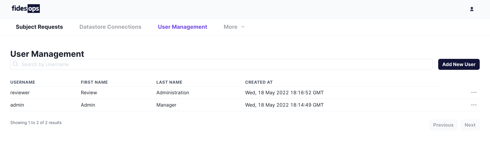
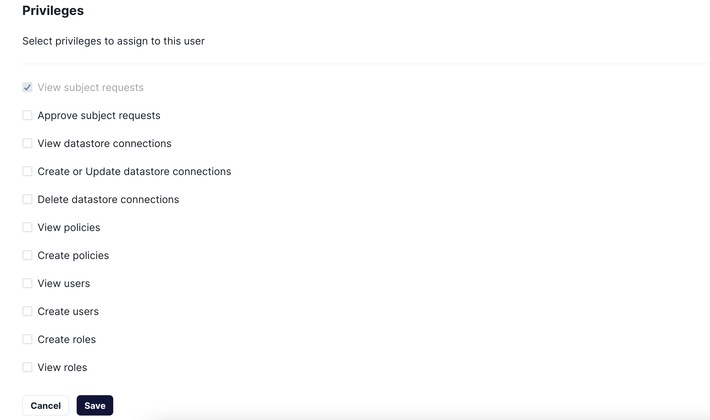
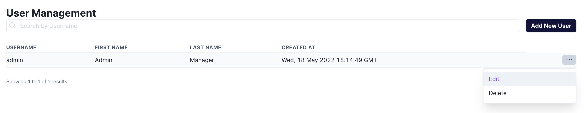

# User Management

## Managing Users from the UI
Fidesops users can be easily managed from the built-in control panel. The User Management panel displays a view of all users within the system, and provides a search bar for retrieving users by username. 




### Creating New Users
The `Add New User` button can create a new user:


### Managing User Scopes
New users can be created with a series of permissions, or scopes, to allow or restrict their access to individual parts of your fidesops configuration. 



#### Scopes


### Editing Existing Users
Existing users can be managed and edited by selecting the "Edit" button from the side of the user row. Users may also be deleted from this drop-down.




## Managing Users from the API 

Fidesops provides several user-related endpoints for managing access to the control panel. Example requests are included in the Fidesops [Postman Collection](./../postman/using_postman.md).


### User and Endpoint Scopes
User permissions are managed through access tokens, which contain scopes associated to individual endpoints. Endpoint access can be restricted by removing their scope from an access token.

Creating a user currently provides access to all scopes.

### Logging in

```
POST api/v1/login
``` 

```json title="Request Body"
{
  "username": "test_username",
  "password": "Suitablylongwithnumber8andsymbol$"
}
```

Successful POST requests to the `login` endpoint will return an `access_token` with all available scopes. This token can be used to make subsequent requests to the Users endpoints.

### Logging out 

```
POST api/v1/logout
``` 

| Authentication | Scope | Description |
|---|---|---|
| Bearer token | N/A | An `access_token` returned from `login`. |

The `logout` endpoint will invalidate the provided `access_token`, which must be included as the Bearer token in your request.

### Creating a user

```
POST api/v1/user
``` 

```json title="Request Body"
{
  "username": "new_username",
  "password": "new_Suitablylongwithnumber8andsymbol$"
}
```

| Authentication | Scope | Description |
|---|---|---|
| Bearer token | `user:create` | An `access_token` returned from `login`. |

The `user` endpoint will create an additional user with the `username` and `password` provided in the request body. An `access_token` with a scope of `user:create` is required.


### Deleting a user

```
DELETE api/v1/user/<user_id>
``` 

| Authentication | Scope | Description |
|---|---|---|
| Bearer token | `user:delete` | An `access_token` returned from `login`. |

An `access_token` with a scope of `user:delete` is required, and must be associated to the Admin UI Root User, or the user you are trying to delete.