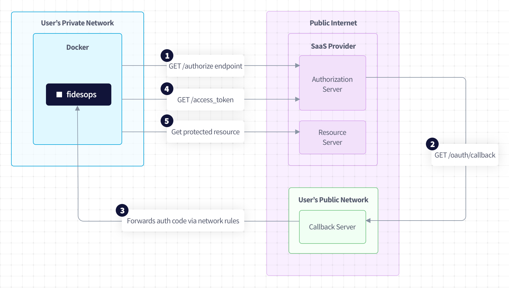

One of the authentication strategies that can be added to a SaaS config is `oauth2`.
!!! Tip "We only currently support the Authorization Code Flow, but are working on adding more."
This authentication strategy has the following configuration values:

- `authorization_request`: The request to build the URL that is presented to the user to authenticate this connection.
- `token_request`: The request that is made to retrieve the access token after the authorization code is returned via the `/oauth/callback` endpoint.
- `refresh_request` (_optional_): The request to refresh an access token.
- `expires_in` (_optional_): The lifetime of an access token (in seconds). This is used if the OAuth2 workflow in use does not provide expiration information ([RFC 6749 Section 5.1](https://datatracker.ietf.org/doc/html/rfc6749#section-5.1)).

## Sample Configuration
Here is the general structure of the oauth2 config. Each request is fully configurable to account for the different ways the parameters can be mapped to a request. The rest of the sections show how each configuration value is mapped to an actual request.
```yaml
authentication:
  strategy: oauth2
  configuration:
    authorization_request:
      ...
    token_request:
      ...
    refresh_request:
      ...
```

### Authorization Request
```yaml
authorization_request:
    method: GET
    path: /auth/authorize
    query_params:
    - name: client_id
        value: <client_id>
    - name: redirect_uri
        value: <redirect_uri>
    - name: response_type
        value: code
    - name: scope
        value: <scope>
    - name: state
        value: <state>
```
This request configuration generates this
```
GET https://<domain>/auth/authorize?client_id=<client_id>&redirect_uri=<redirect_uri>&response_type=code&scope=<scope>&state=<state>
```
All of the placeholders are sourced from the values defined in the `connector_params`. The only exception is the `<state>` placeholder which is generated automatically with each authorization request. This authorization URL can be retrieved by calling:
```
GET https://{{domain}}/api/v1/connection/{{connection_key}}/authorize
```

### Token Request
```yaml
token_request:
    method: POST
    path: /oauth/token
    query_params:
    - name: client_id
        value: <client_id>
    - name: client_secret
        value: <client_secret>
    - name: grant_type
        value: authorization_code
    - name: code
        value: <code>
```
The `<code>` placeholder is defined automatically by Fidesops. This request configuration generates this
```
GET https://<domain>/oauth_token?client_id=<client_id>&client_secret=<client_secret>&grant_type=authorization_code&code=<code>
```
This request is called automatically after Fidesops receives a callback response to the `https://{{domain}}/api/v1/oauth/callback` endpoint.

### Refresh Request
```yaml
refresh_request:
    method: POST
    path: /oauth/token
    query_params:
    - name: client_id
        value: <client_id>
    - name: client_secret
        value: <client_secret>
    - name: grant_type
        value: refresh_token
    - name: refresh_token
        value: <refresh_token>
```
The `<refresh_token>` placeholder is defined automatically by Fidesops. This request configuration generates this
```
GET https://<domain>/oauth_token?client_id=<client_id>&client_secret=<client_secret>&grant_type=refresh_token&refresh_token=<refresh_token>
```
This is called automatically when the access_token is about to expire. The expiration is usually defined in the response to the token request but if the expiration is not returned by the API it can be specified manually by defining the `expires_in` field (which is defined in seconds).
```yaml
authentication:
  strategy: oauth2
  configuration:
    expires_in: 3600
    authorization_request:
      ...
    token_request:
      ...
    refresh_request:
      ...
```

## Usage Checklist

In order to have OAuth2 working for a connector, these things must be configured first:

#### One-time configuration
- A callback server or network rules are required to forward the callback response from the SaaS providers to an instance of Fidesops. This is dependent on the user environment where Fidesops is deployed so this is out of scope for this documentation.
- These incoming requests must be routed to `https://{{host}}/api/v1/oauth/callback`.

#### Per-connector configuration
- Fidesops must be able to connect to the SaaS provider (Outreach, Salesforce, etc.).
- A **Client ID** and **Client Secret** must be generated within the SaaS provider’s admin console.
    - This will be dependent on the SaaS provider, refer to their documentation for this .
- The **Redirect URI** must be registered within the SaaS provider's admin console.
- The connector using OAuth2 is configured using the steps for [how to configure a SaaS connector](../saas_connectors/#how-to-configure-a-saas-connector).
- The OAuth2 workflow is initialized by following the URL returned from `https://{{domain}}/api/v1/connection/{{connection_key}}/authorize`.

## OAuth2 Workflow Diagram
